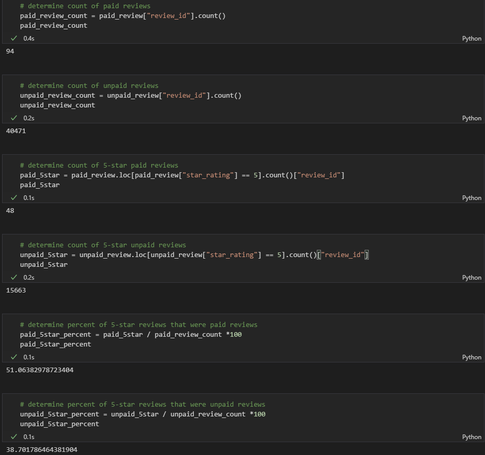

# Amazon_Vine_Analysis

# Overview
This analysis uses anonymized review data from Amazon for a particular product class to explore the effect of Amazon's Vine program. The Vine program essentially allows companies to incentivize customers to write a review for their product. This analysis will explore the impact of the program, if any, on reviews.

# Results
 - In the dataset used the number of Vine reviews were 94, compared to 40471 non-Vine reviews
 - The number of 5-star Vine reviews were 48, compared to 15663 non-Vine reviews
 - The percentage of 5-star Vine reviews is 51.1%, compared to 38.7% of non-Vine reviews

See the image below for the python calculations

# Summary
The Vine program clearly produces positivity bias in the reviews (51% vs 39% 5-star rating), though the sheer amount of non-Vine reviews may negate their effect. Further analysis should consider the percentage of Vine reviews for each product (as opposed to the entire product class used here) and look to see if a significant positive skew resulted.
